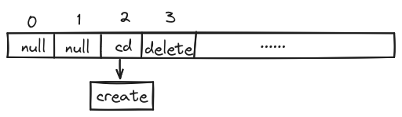

既然已经出分了，那就把代码分享出来吧~

**温馨提示**
* 代码仅供学习参考
* 代码是在 Ubuntu 22.04.2 LTS 上编译通过的
* 若要运行，请自行建立`build`文件夹，用`cmake`相关指令编译
* 没有实现文件续写的功能，而这是验收的得分点之一

下面是要求提交的`README`文件
_____

# 1. 类EXT2文件系统模拟
- [1. 类EXT2文件系统模拟](#1-类ext2文件系统模拟)
  - [1.1. 代码模块组织](#11-代码模块组织)
  - [1.2. 磁盘管理模块](#12-磁盘管理模块)
  - [1.3. 逻辑文件系统模块](#13-逻辑文件系统模块)
    - [1.3.1. 组描述符](#131-组描述符)
    - [1.3.2. 数据块位图](#132-数据块位图)
    - [1.3.3. 索引结点位图](#133-索引结点位图)
    - [1.3.4. 索引结点表](#134-索引结点表)
    - [1.3.5. 数据块](#135-数据块)
    - [1.3.6. 实现的功能](#136-实现的功能)
  - [1.4. 用户接口模块](#14-用户接口模块)
    - [1.4.1. 命令行交互部分](#141-命令行交互部分)
    - [1.4.2. 文件操作部分](#142-文件操作部分)
  - [1.5. 遇到的问题](#15-遇到的问题)
    - [1.5.1. 大小端问题](#151-大小端问题)
    - [1.5.2. 用户输入文件内容](#152-用户输入文件内容)

## 1.1. 代码模块组织
```
lab3
├── build
│   ├── EXT2_SIM
│   └── ......
├── main.c
├── disk_manage
│   ├── disk.c
│   └── disk.h
├── logical_file_sys
│   ├── block.c
│   ├── block.h
│   ├── group.c
│   ├── group.h
│   └── logical_struct.h
├── user_interface
│   ├── file.c
│   ├── file.h
│   ├── shell.c
│   └── shell.h
├── test
│   └── 8_blocks.txt
├── README.md
├── FS.txt
└── CMakeLists.txt
```
代码分三个模块，自低向上分别是：

* 磁盘管理模块
* 逻辑文件系统模块
* 用户接口模块

磁盘管理模块负责把逻辑位置转换到物理位置，逻辑文件系统模块负责文件系统的逻辑结构，用户接口模块负责用户的交互。

这次实验我用 `CMake` 管理代码。`build` 文件夹负责存放编译后的文件。

## 1.2. 磁盘管理模块
定义了块大小，块的数量，数据块的起始位置，磁盘大小，模拟磁盘的文件，文件描述符。
```c
#define BLOCK_NUM 4611 // 磁盘中块的总数
// 组描述符1+两个位图2+索引节点块512+数据块4096
// 从0开始计数

#define BLOCK_SIZE 512 // 块大小为512字节
#define DATA_BLOCK_START 515 // 数据块起始位置，从0开始计数，单位为块
#define DISK_NAME "../FS.txt" // 模拟磁盘的文件
```

接收块偏移，块号或索引结点号，把文件指针移动到相应的位置。在上一层中，传入的块偏移一般是 `group_desc.block_bitmap` 或 `group_desc.inode_bitmap`

## 1.3. 逻辑文件系统模块

文件系统只有一个组，只有一个用户。

磁盘文件被分为五部分：
* 组描述符
* 数据块位图
* 索引结点位图
* 索引结点表
* 数据块

### 1.3.1. 组描述符
组描述符占一个数据块，存放组描述符结构和密码
```c
typedef struct group_desc_t {
  char bg_volume_name[16];       // 卷名
  uint16_t bg_block_bitmap;      // 保存块位图的块号
  uint16_t bg_inode_bitmap;      // 保存索引节点位图的块号
  uint16_t bg_inode_table;       // 索引节点表的起始块号
  uint16_t bg_free_blocks_count; // 本组空闲块个数
  uint16_t bg_free_inodes_count; // 本组空闲索引节点个数
  uint16_t bg_used_dirs_count;   // 本组目录的个数
  char bg_pad[4];                // 填充(0xff)
} group_desc_t;
```
组描述符后面紧随着存放的是密码，后面第一个字节是密码长度，后面是密码内容。

### 1.3.2. 数据块位图
占一个数据块，每个比特位代表一个数据块，1表示已经被使用，0表示空闲。从左往右，比特位的和数据块一一对应。

一个块有512字节，可以表示4096个数据块。

### 1.3.3. 索引结点位图
占一个数据块，每个比特位代表一个索引结点，1表示已经被使用，0表示空闲。从左往右，比特位的和索引结点一一对应。

一共有表示4096个索引结点。

### 1.3.4. 索引结点表
索引结点结构：
```c
typedef struct inode_t {
  uint16_t i_mode;         // 文件类型和访问权限
  uint16_t i_blocks_count; // 文件的数据块个数
  uint32_t i_size;         // 大小（字节）
  uint64_t i_atime;        // 访问时间
  uint64_t i_ctime;        // 创建时间
  uint64_t i_mtime;        // 修改时间
  uint64_t i_dtime;        // 删除时间
  uint16_t i_block[8];     // 指向数据块的指针
  char i_pad[8];           // 填充
} inode_t;
```
一个索引结点占64字节，一个数据块可以存放512/64=8个索引结点。索引结点表占4096/8=512个数据块。

### 1.3.5. 数据块
数据块结构：
```c
typedef struct block_t {
  uint8_t data[BLOCK_SIZE]; // 数据块内容
} block_t;
```
一个数据块占512字节，共有4096个数据块。

数据块中可能存放文件内容，也可能存放目录项。

目录项结构：
```c
typedef struct dir_entry_t {
  uint16_t inode;           // 索引节点号
  uint16_t rec_len;         // 目录项长度
  uint8_t name_len;         // 文件名长度
  uint8_t file_type;        // 文件类型
  char name[FILE_NAME_LEN]; // 文件名最大255字符，最后一个结束符
} dir_entry_t;
```
目录项的长度是不固定的，为了节省空间，一个目录项的地址，向后移动 `rec_len` 个字节，就可以找到下一个目录项。

### 1.3.6. 实现的功能
- 块层面：
  - 加载、更新索引结点
  -  加载、更新数据块
  - 分配、释放数据块和索引结点

其中，由于存在多级索引，加载、更新数据块是通过递归实现的。

- 组层面：
  - 格式化组
  - 初始化组
  - 加载、更新组描述符
  - 读取、更新一个索引结点的所有数据块
  - 给一个索引结点添加数据块
  - 释放一个索引结点的所有数据块
  - 读取、创建、更新目录项

## 1.4. 用户接口模块

用户接口模块负责用户的交互，包括命令行解析，命令执行，命令的帮助信息。
这一模块被分为两部分，一部分是命令行交互部分，一部分是文件操作部分。

### 1.4.1. 命令行交互部分

这一部分模仿终端的交互方式，每次输入一行命令，然后解析出命令的名称和参数，然后调用对应的函数来执行命令。

提供的命令：
- `format` 格式化文件系统
- `help` 帮助信息
- `ls` 列出当前目录下的目录项信息
- `cd` 切换当前目录
- `create` 创建文件
- `delete` 删除文件
- `read` 读取文件
- `write` 写入文件
- `password` 修改密码
- `mkdir` 创建目录
- `rmdir` 删除目录
- `quit` 退出
- `clear` 清屏

解析命令的过程用到了哈希表和函数指针。

内存中维护一个哈希表，用来存放命令和对应的函数的映射关系。表的长度是26，内容是结构体 `command_map`:
```c
typedef struct command_map {
  char *command_name;
  command_func func;
  struct command_map *next;
} command_map;
```
`command_name` 是命令的名称，`func` 是命令对应的函数，`next` 是下一个命令。

命令名称的首字母决定了命令在哈希表中的位置，比如 `cd` 命令的首字母是 `c`，那么它在哈希表中的位置是 `'c' - 'a'`，也就是 `2`。

如果哈希表中的位置已经有命令了，那么就把新的命令放在 `next` 指针指向的位置。



### 1.4.2. 文件操作部分

这一部分负责文件操作，包括创建文件，删除文件，读取文件，写入文件，还有目录的创建和删除。

这部分定义了`current_path_t`结构体，用来存放当前目录的信息。
```c
typedef struct current_path_t {
  uint16_t path_inode[MAX_PATH_DEPTH]; // 路径数组，内容是inode号
  uint8_t depth;       // 路径深度，也就是path数组的长度
  char path_name[256]; // 路径名，从根目录到当前目录
  dir_entry_t *dirs;   // 当前目录中的目录项数组
  uint16_t dir_count;  // 目录项个个数
} current_path_t;
```

## 1.5. 遇到的问题
### 1.5.1. 大小端问题
在 `block.c`, `load_block_muti_level` 中的这段代码：
```c
block_t sub_block = load_block_entry(block_No);
uint16_t data_block_No[sizeof(sub_block.data) /
                        sizeof(uint16_t)]; // 下一级数据块的块号
memset(data_block_No, 0, sizeof(sub_block.data));
memcpy(data_block_No, &sub_block.data, sizeof(sub_block.data));
```

`sub_block.data` 是一个 `uint8_t` 数组，`data_block_No` 是一个 `uint16_t` 数组。`memcpy` 时，会出现大小端问题。

`sub_block.data` 的内容为
```
"\000\002", '\000' <repeats 509 times>
```
`data_block_No[0]` 的内容为 `0x20`。

可以用 `ntohs` 解决大小端问题。
```c
for (int i = 0; i < sizeof(sub_block.data) / sizeof(uint16_t); i++) {
  if (data_block_No[i] == 0) {
    break;
  }
  data_block_No[i] = ntohs(((uint16_t *)sub_block.data)[i]);
}
```

也可以用位操作解决大小端问题。
```c
data_block_No[i] = sub_block.data[i] << 8;
data_block_No[i] |= sub_block.data[i + 1];
```

### 1.5.2. 用户输入文件内容
用户输入文件内容时，用 `scanf` 函数会出现问题，因为 `scanf` 遇到空格就会停止读取。所以用 `getline` 函数。